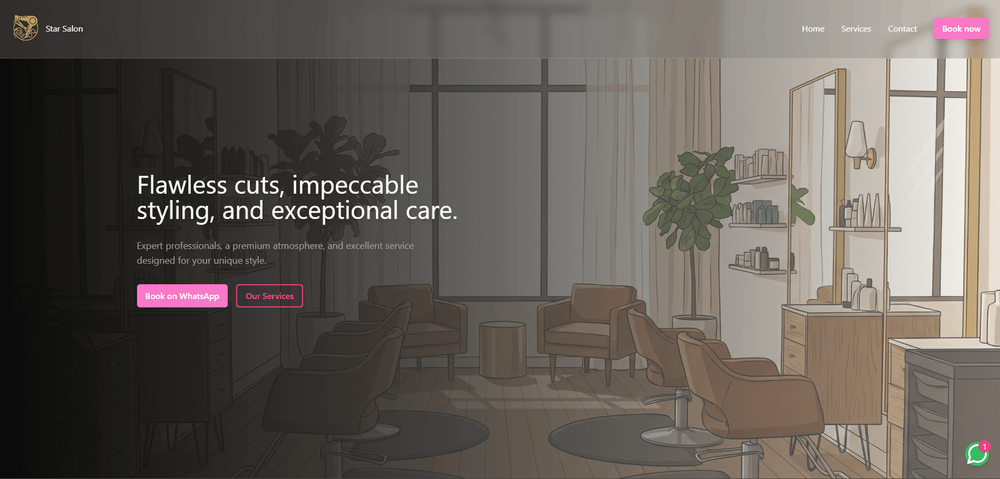

<h1 align="center">Star Salon ✂️🪮💅🏻 </h1>

 Modern landing page for a high-end beauty salon. The project utilizes React, TypeScript and Tailwind CSS to create an immersive interface with a "Dark Mode" aesthetic.

  

  
  <a href="#-screenshots">Screenshots</a>&nbsp;&nbsp;&nbsp;|&nbsp;&nbsp;&nbsp;
  <a href="#-technologies">Technologies</a>&nbsp;&nbsp;&nbsp;|&nbsp;&nbsp;&nbsp;
  <a href="#-features">Features</a>&nbsp;&nbsp;&nbsp;|&nbsp;&nbsp;&nbsp;
  <a href="#-license">License</a>&nbsp;&nbsp;&nbsp;|&nbsp;&nbsp;&nbsp;
  <a href="#-contributing">Contributing</a>&nbsp;&nbsp;&nbsp;|&nbsp;&nbsp;&nbsp;
  <a href="#support">Support</a>  

 

## 📸 Screenshots

  

 

## 🛠 Technologies

- React
- TypeScript
- Vite
- Tailwind
- Git and GitHub

 

## ✨ Features

- Glassmorphism UI
- Neon Interactive Elements
- WhatsApp Integration
- Floating Booking Button

 
