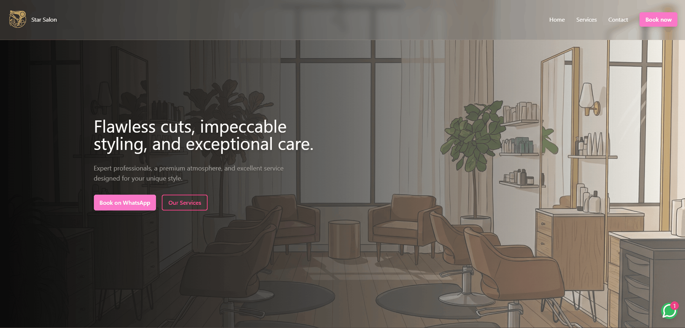

<h1 align="center">Star Salon ✂️🪮💅🏻 </h1>

<p align="center">
 Modern landing page for a high-end beauty salon. The project utilizes React, TypeScript and Tailwind CSS to create an immersive interface with a "Dark Mode" aesthetic.
</p>


<p align="center">
  
</p>


<p align="center">  
  <a href="#-live-demo">Live Demo</a>&nbsp;&nbsp;&nbsp;|&nbsp;&nbsp;&nbsp;
  <a href="#-screenshots">Screenshots</a>&nbsp;&nbsp;&nbsp;|&nbsp;&nbsp;&nbsp;
  <a href="#-technologies">Technologies</a>&nbsp;&nbsp;&nbsp;|&nbsp;&nbsp;&nbsp;
  <a href="#-features">Features</a>&nbsp;&nbsp;&nbsp;|&nbsp;&nbsp;&nbsp;
  <a href="#-how-to-run">How to Run</a>&nbsp;&nbsp;&nbsp;|&nbsp;&nbsp;&nbsp;
  <a href="#-license">License</a>&nbsp;&nbsp;&nbsp;|&nbsp;&nbsp;&nbsp;
  <a href="#-contributing">Contributing</a>&nbsp;&nbsp;&nbsp;|&nbsp;&nbsp;&nbsp;
  <a href="#support">Support</a>  
</p>

<br>

## 🌐 Live Demo

<p align="center">
  <a href="https://beauty-salon-website.onrender.com">
    
  </a>
</p>

<p align="center">
  <sub>Tip: Use right-click → “Open in new tab”.</sub>
</p>


<br>

## 📸 Screenshots

<p align="center">
  
</p>

<br>

## 🛠 Technologies

- React
- TypeScript
- Vite
- Tailwind
- Git and GitHub

<br>

## ✨ Features

- Glassmorphism UI
- Neon Interactive Elements
- WhatsApp Integration
- Floating Booking Button

<br>

## ⚙ How to Run

### 📋 Requirements

- Web browser ([Chrome](https://www.google.com/chrome/), [Edge](https://www.microsoft.com/edge), [Firefox](https://www.mozilla.org/firefox/), etc)
- Node

<br>

### 👣 Steps

1.  **Clone o repositório:**
    ```bash
    git clone https://github.com/Chrysthy/beauty-salon-website.git
    ```
2.  **Navegue até o diretório do projeto:**
    ```bash
    cd beauty-salon-website
    ```
3.  **Install dependencies:**
    ```bash
    npm install
    ```

4.  **Run the development server:**
    ```bash
    npm run dev
    ```

<br>


## 📜 License

- This project is licensed under the [MIT License](https://choosealicense.com/licenses/mit/)

<br>

## 🫱🏻‍🫲🏻 Contributing

<p> Contributions, issues, and feature requests are welcome! Please, feel free to do it! 😉 </p>

<br>

## 🌟 Support

<p> If you like this project, please give it a star ⭐ and share it with others! 😄 </p>
